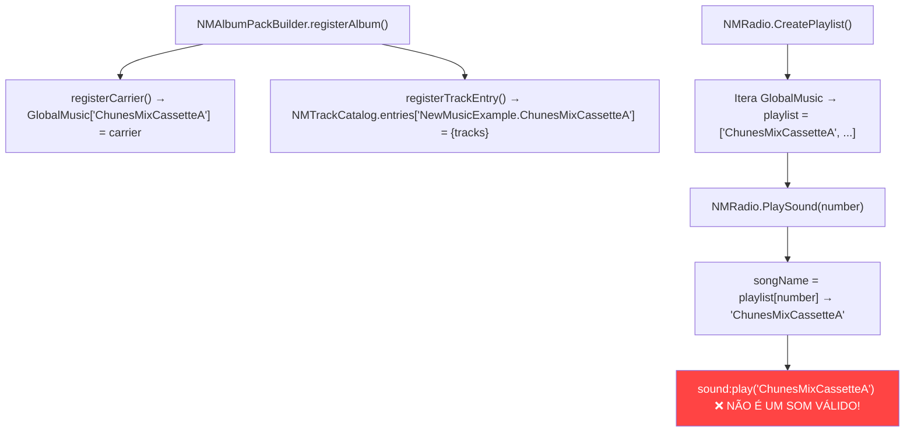
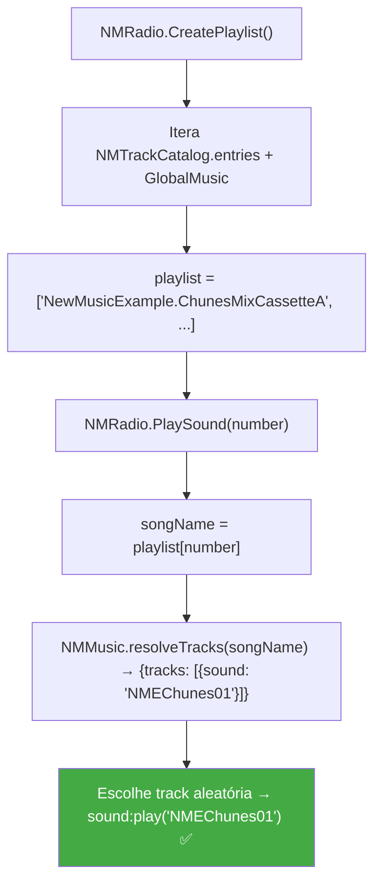

# Correção: Rádio Não Reproduz Áudio de Mods de Expansão (NMTrackCatalog)

## Contexto e Diagnóstico da Causa Raiz

O bug reportado pelo desenvolvedor externo está **100% confirmado** pela análise do código. A causa raiz é clara e isolada:

### O Problema Central

Existem **dois sistemas de registro de músicas** que coexistem:

| Sistema | Usado Para | Formato das Keys | Quem Popula |
|---------|-----------|-------------------|-------------|
| `GlobalMusic` | Legacy True Music / itens cujo nome do tipo = nome do som | Short keys: `"CassetteMainTheme"` | [NMAlbumPackBuilder.lua](file:///c:/Users/kleit/Zomboid/Workshop/New-Music-Radio-B42/TalisNewMusic/42/media/lua/shared/NMAlbumPackBuilder.lua#L47-L54) via `registerCarrier()` |
| `NMTrackCatalog.entries` | Novo sistema NM (o padrão atual) | Full-type keys: `"NewMusicExample.ChunesMixCassetteA"` | [NMAlbumPackBuilder.lua](file:///c:/Users/kleit/Zomboid/Workshop/New-Music-Radio-B42/TalisNewMusic/42/media/lua/shared/NMAlbumPackBuilder.lua#L143-L150) via `registerTrackEntry()` |

**O NMRadio (mod principal do rádio) usa APENAS `GlobalMusic`** para construir playlists, e trata as keys de `GlobalMusic` como **nomes de som diretos**, enviando-os para `sound:play()`.

### Fluxo Atual (com Bug)



O som `ChunesMixCassetteA` **não existe** como definição de áudio. Os sons reais são `NMEChunes01`, `NMEChunes02`, etc., definidos em [NewMusicExample_Cassette_Sounds.txt](file:///c:/Users/kleit/Zomboid/Workshop/New-Music-Radio-B42/NewMusicExample/42/media/scripts/NewMusicExample_Cassette_Sounds.txt).

### Por que Alguns Mods Funcionam?

Mods legados do **True Music** funcionam porque seguem uma convenção onde o **nome do tipo do item** era **idêntico** ao nome do som. No novo sistema `NMTrackCatalog`, os itens têm nomes descritivos (ex: `ChunesMixCassetteA`) e os sons têm nomes diferentes (ex: `NMEChunes01`).

### Fluxo Correto (com Fix)



---

## Arquivos Afetados

O bug se manifesta em **8 locais** do código, todos dentro do módulo `Contents/mods/ModTemplate/`:

> [!IMPORTANT]
> Todos os pontos de `for k,v in pairs(GlobalMusic) do` precisam ser atualizados para incluir também as entradas do `NMTrackCatalog`.

### Resumo dos Locais

| # | Arquivo | Linha | Contexto |
|---|---------|-------|----------|
| 1 | [NMRadio.lua](file:///c:/Users/kleit/Zomboid/Workshop/New-Music-Radio-B42/Contents/mods/ModTemplate/42/media/lua/client/NewMusicRadio/NMRadio.lua#L2034-L2097) | 2037 | `CreatePlaylist()` – monta a playlist das estações |
| 2 | [NMRadio.lua](file:///c:/Users/kleit/Zomboid/Workshop/New-Music-Radio-B42/Contents/mods/ModTemplate/42/media/lua/client/NewMusicRadio/NMRadio.lua#L1487) | 1487 | `syncPlaylistRequest` – compara playlist global |
| 3 | [NMRadio.lua](file:///c:/Users/kleit/Zomboid/Workshop/New-Music-Radio-B42/Contents/mods/ModTemplate/42/media/lua/client/NewMusicRadio/NMRadio.lua#L298-L366) | 352-364 | `PlaySound()` – converte songName → som e toca |
| 4 | [NMRServer.lua](file:///c:/Users/kleit/Zomboid/Workshop/New-Music-Radio-B42/Contents/mods/ModTemplate/42/media/lua/server/NewMusicRadio/NMRServer.lua#L150-L155) | 153 | `CreatePlaylist()` server-side |
| 5 | [NMRServer.lua](file:///c:/Users/kleit/Zomboid/Workshop/New-Music-Radio-B42/Contents/mods/ModTemplate/42/media/lua/server/NewMusicRadio/NMRServer.lua#L619-L624) | 622 | `OnServerStarted` – playlist global server |
| 6 | [UseTerminalMenu.lua](file:///c:/Users/kleit/Zomboid/Workshop/New-Music-Radio-B42/Contents/mods/ModTemplate/42/media/lua/client/NewMusicRadio/UseTerminalMenu.lua#L74) | 74 | Terminal creation – popula terminal com músicas |
| 7 | [UseTerminalMenu.lua](file:///c:/Users/kleit/Zomboid/Workshop/New-Music-Radio-B42/Contents/mods/ModTemplate/42/media/lua/client/NewMusicRadio/UseTerminalMenu.lua#L243) | 243 | Eject media – lista músicas para ejetar |
| 8 | [UseTerminalMenu.lua](file:///c:/Users/kleit/Zomboid/Workshop/New-Music-Radio-B42/Contents/mods/ModTemplate/42/media/lua/client/NewMusicRadio/UseTerminalMenu.lua#L342) | 342 | Blacklist menu – lista músicas para blacklist |

---

## Proposta de Correção

A correção envolve **duas mudanças conceituais**:

### Mudança 1: Unificar a Fonte de Dados das Playlists

Criar uma função helper que mescla `GlobalMusic` e `NMTrackCatalog.entries` numa lista unificada de media keys.

### Mudança 2: Resolver Tracks Corretamente na Reprodução

Na função `PlaySound`, ao invés de usar `songName` diretamente como nome de som, usar `NMMusic.resolveTracks()` para obter o `sound` real de cada track.

---

## Proposed Changes

### Helper Function (Novo)

#### [NEW] Helper function em NMRadio.lua

Adicionar no topo de `NMRadio.lua` (após o bloco de requires/inicialização) uma função helper:

```lua
-- Builds a unified music key list from both GlobalMusic (legacy)
-- and NMTrackCatalog (new system). Returns an array of string keys.
local function buildUnifiedMusicKeys()
    local seen = {}
    local keys = {}

    -- 1) Legacy GlobalMusic keys (True Music compat)
    if type(GlobalMusic) == "table" then
        for k, _ in pairs(GlobalMusic) do
            if not seen[k] then
                seen[k] = true
                keys[#keys + 1] = k
            end
        end
    end

    -- 2) NMTrackCatalog entries (new NM system)
    if type(NMTrackCatalog) == "table" and type(NMTrackCatalog.entries) == "table" then
        for k, _ in pairs(NMTrackCatalog.entries) do
            -- NMTrackCatalog uses full-type keys like "NewMusicExample.ChunesMixCassetteA"
            -- Extract the short key for dedup against GlobalMusic
            local shortKey = k
            local dotPos = string.find(k, ".", 1, true)
            if dotPos then
                shortKey = string.sub(k, dotPos + 1)
            end
            -- Only add if the short key wasn't already in GlobalMusic
            if not seen[shortKey] and not seen[k] then
                seen[k] = true
                keys[#keys + 1] = k
            end
        end
    end

    return keys
end
```

---

### NMRadio.lua – Playlist & Playback

#### [MODIFY] [NMRadio.lua](file:///c:/Users/kleit/Zomboid/Workshop/New-Music-Radio-B42/Contents/mods/ModTemplate/42/media/lua/client/NewMusicRadio/NMRadio.lua)

**Mudança 1 — Linha 2034-2039**: `CreatePlaylist()` deve usar `buildUnifiedMusicKeys()`:

```diff
 NMRadio.CreatePlaylist = function()
 	local tempGlobalPlaylist = {}
 
-	for k,v in pairs(GlobalMusic) do
-		tempGlobalPlaylist[#tempGlobalPlaylist + 1] = k
-	end
+	tempGlobalPlaylist = buildUnifiedMusicKeys()
```

**Mudança 2 — Linha 1486-1489**: Sync playlist global comparison:

```diff
 		NMRadio.PlaylistGlobal = {}
-		for k,v in pairs(GlobalMusic) do
-			NMRadio.PlaylistGlobal[#NMRadio.PlaylistGlobal + 1] = k
-		end
+		NMRadio.PlaylistGlobal = buildUnifiedMusicKeys()
```

**Mudança 3 — Linhas 348-365**: `PlaySound()` deve resolver o som real via `NMMusic.resolveTracks()`:

```diff
 	if songName == nil then
 		print("NMRadio: Error processing requested song")
 		return
 	else
-		local musicItem = "NewMusic." .. songName
-		local displayName = getItemNameFromFullType(musicItem)
+		-- Resolve the actual sound name via NMTrackCatalog/NMMusic
+		local resolvedSound = songName
+		local displayKey = songName
+		local dotPos = string.find(songName, ".", 1, true)
+		if dotPos then
+			displayKey = songName  -- already has module prefix
+		else
+			displayKey = "NewMusic." .. songName  -- legacy key, add module prefix
+		end
+		
+		-- Try to resolve tracks from NMTrackCatalog first
+		if NMMusic and NMMusic.resolveTracks then
+			local resolved = NMMusic.resolveTracks(displayKey)
+			if not resolved and dotPos then
+				-- Try without module prefix as fallback
+				resolved = NMMusic.resolveTracks(songName)
+			end
+			if resolved and resolved.tracks and #resolved.tracks > 0 then
+				-- Pick a random track from the resolved entry
+				local trackIndex = ZombRand(1, #resolved.tracks + 1)
+				resolvedSound = resolved.tracks[trackIndex].sound
+				if resolved.tracks[trackIndex].label then
+					displayKey = resolved.tracks[trackIndex].label
+				end
+			end
+		end
+		
+		local displayName = getItemNameFromFullType(displayKey)
+		if displayName == displayKey then
+			-- getItemNameFromFullType didn't find it, use the raw label
+			displayName = displayKey
+		end
 		local prettyName = NMRadio.prettyName(displayName)
 		if deviceData:getChannel() > 1000 then
 			print("NMRadio Channel " .. deviceData:getChannel()/1000 .. "FM: Playing song[" .. number .. "] " .. prettyName)
 		else
 			print("NMRadio MTV " .. deviceData:getChannel() .. "TV: Playing song[" .. number .. "] " .. prettyName)
 		end
 		if PZAPI.ModOptions:getOptions("NewMusicRadio"):getOption("NMRenableRDSDeviceText"):getValue() and SandboxVars.NewMusicRadio.NMRRadioSongAnnouncements and not isClient() then 
 			DynamicRadio.OnNewSong(deviceData:getChannel(), prettyName)
 		end
 		if not PZAPI.ModOptions:getOptions("NewMusicRadio"):getOption("NMRstopMusic"):getValue() then
-			sound:play(songName)
+			sound:play(resolvedSound)
 		end
 	end
```

---

### NMRServer.lua – Server-Side Playlists

#### [MODIFY] [NMRServer.lua](file:///c:/Users/kleit/Zomboid/Workshop/New-Music-Radio-B42/Contents/mods/ModTemplate/42/media/lua/server/NewMusicRadio/NMRServer.lua)

> [!IMPORTANT]
> O servidor também precisa da mesma função helper, pois ele cria playlists independentemente.

**Adicionar função helper** (mesma lógica que no client) no topo do arquivo:

```lua
local function buildUnifiedMusicKeys()
    -- (mesma implementação do client)
end
```

**Mudança 4 — Linha 150-155**: `CreatePlaylist()` server:

```diff
 NMRadioServer.CreatePlaylist = function()
 	local tempGlobalPlaylist = {}
-	for k,v in pairs(GlobalMusic) do
-		tempGlobalPlaylist[#tempGlobalPlaylist + 1] = k
-	end
+	tempGlobalPlaylist = buildUnifiedMusicKeys()
```

**Mudança 5 — Linha 621-624**: `OnServerStarted`:

```diff
 	NMRadioServer.PlaylistGlobal = {}
-	for k,v in pairs(GlobalMusic) do
-		NMRadioServer.PlaylistGlobal[#NMRadioServer.PlaylistGlobal + 1] = k
-	end
+	NMRadioServer.PlaylistGlobal = buildUnifiedMusicKeys()
```

---

### UseTerminalMenu.lua – UI Menus

#### [MODIFY] [UseTerminalMenu.lua](file:///c:/Users/kleit/Zomboid/Workshop/New-Music-Radio-B42/Contents/mods/ModTemplate/42/media/lua/client/NewMusicRadio/UseTerminalMenu.lua)

> [!WARNING]
> No UseTerminalMenu, as linhas 243-244 adicionam o prefixo `"NewMusic."` ao construir a lista. Essa lógica precisa ser adaptada para funcionar com chaves que já contêm prefixo de módulo (de NMTrackCatalog) ou não (de GlobalMusic).

**Mudança 6 — Linha 73-76**: Terminal creation:

```diff
 				local tempGlobalPlaylist = {}
-				for k,v in pairs(GlobalMusic) do
-    				    tempGlobalPlaylist[#tempGlobalPlaylist + 1] = k
-				end
+				tempGlobalPlaylist = buildUnifiedMusicKeys()
```

**Mudança 7 — Linha 242-244**: Eject media list:

```diff
 		local tempGlobalPlaylist = {}
-		for k,v in pairs(GlobalMusic) do
-			tempGlobalPlaylist[#tempGlobalPlaylist + 1] = "NewMusic." .. k
-		end
+		for _, k in ipairs(buildUnifiedMusicKeys()) do
+			local dotPos = string.find(k, ".", 1, true)
+			if dotPos then
+				tempGlobalPlaylist[#tempGlobalPlaylist + 1] = k
+			else
+				tempGlobalPlaylist[#tempGlobalPlaylist + 1] = "NewMusic." .. k
+			end
+		end
```

**Mudança 8 — Linha 341-344**: Blacklist menu:

```diff
 		local tempGlobalPlaylistBlacklist = {}
-		for k,v in pairs(GlobalMusic) do
-			tempGlobalPlaylistBlacklist[#tempGlobalPlaylistBlacklist + 1] = k
-		end
+		tempGlobalPlaylistBlacklist = buildUnifiedMusicKeys()
```

---

## Open Questions

> [!IMPORTANT]
> **Questão 1 — Escopo da função helper**: A função `buildUnifiedMusicKeys()` é local em cada arquivo. Seria preferível colocá-la como uma função global/compartilhada (ex: em `NMMediaContract.lua` ou um novo arquivo `NMPlaylistHelper.lua`) para evitar duplicação? Isso depende da sua preferência de manutenção.

> [!IMPORTANT]
> **Questão 2 — Dados de save existentes**: Jogadores com saves antigos terão playlists armazenadas no `ModData` com as chaves antigas (short keys de `GlobalMusic`). A lógica de comparação de `OldPlaylistGlobal` vs `PlaylistGlobal` em linhas 1490 e 625-626 vai detectar a diferença de tamanho e regenerar automaticamente as playlists — isso é o comportamento correto e desejado? Ou você quer um mecanismo de migração mais suave?

> [!IMPORTANT]
> **Questão 3 — Track aleatório vs completo**: No `PlaySound()`, quando a playlist contém uma chave que resolve para múltiplas tracks (ex: `ChunesMixCassetteA` tem 8 tracks), o rádio deve tocar uma track aleatória da lista? Ou deve tocar sequencialmente? Atualmente propus aleatório (`ZombRand`).

---

## Verification Plan

### Testes Manuais

1. **Verificar que `NMTrackCatalog.entries` está populado**:
   - Adicionar um print temporário no `NMAlbumPackBuilder.registerAlbum` para confirmar que `NMTrackCatalog.entries` recebe as entradas do NewMusicExample
   
2. **Verificar que `buildUnifiedMusicKeys()` retorna chaves de ambos os sistemas**:
   - Adicionar print na `CreatePlaylist()` para listar todas as chaves retornadas
   
3. **Teste in-game completo**:
   - Ativar o rádio no jogo com o NewMusicExample ativado
   - Confirmar que as músicas do NewMusicExample tocam (áudio real emitido)
   - Confirmar que as músicas legacy (PZ OST) continuam funcionando
   - Confirmar que o UI mostra o nome correto da música tocando

4. **Teste multiplayer (se aplicável)**:
   - Verificar que o servidor gera playlists corretas com as mesmas mudanças no NMRServer.lua
